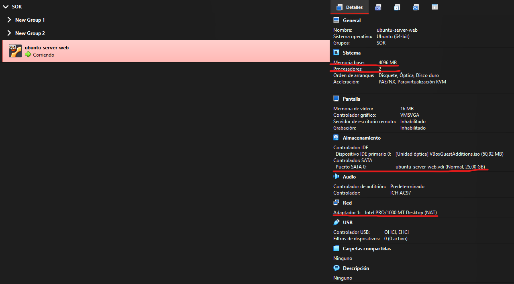
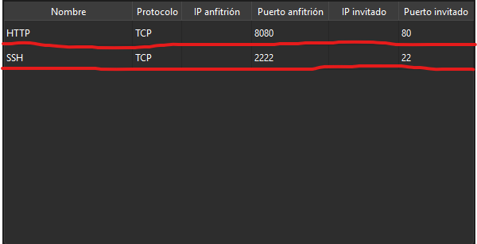
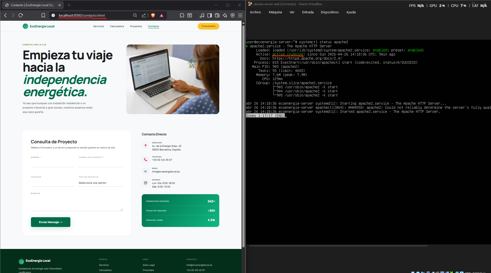

# Memoria Técnica: Instalación y Configuración del Servidor EcoEnergía

## 1. Resumen del Proyecto
Este documento describe el proceso de despliegue de un servidor web basado en **Linux** para el entorno EcoEnergía. Se ha priorizado la seguridad, la eficiencia de recursos y la capacidad de edición remota.

---

## 2. Infraestructura Virtual
Se ha optado por **VirtualBox** como hipervisor para aislar el entorno del servidor del sistema operativo anfitrión (Windows).

### Especificaciones de la VM:
* **Sistema Operativo:** Ubuntu Server 24.04 LTS (Sin entorno gráfico para ahorrar RAM).
* **RAM:** 4096 MB.
* **Procesador:** 2 CPU.
* **Red:** Configuración NAT con túneles de puerto.
* **Memoria:** 25 GB.

> 
> *Figura 1: Configuración de recursos de la máquina virtual.*

---

## 3. Configuración de Red (Port Forwarding)
Para permitir que las herramientas de Windows se comuniquen con el servidor Linux interno, se configuraron reglas de reenvío de puertos:

| Nombre | Protocolo | Puerto Anfitrión | Puerto Invitado |
| :--- | :--- | :--- | :--- |
| **SSH (SFTP)** | TCP | 2222 | 22 |
| **HTTP (Web)** | TCP | 8080 | 80 |

> 
> *Figura 2: Detalle de las reglas de entrada al servidor.*

---

## 4. Instalación del Stack de Software
Una vez arrancada la máquina, se procedió a la instalación del servidor web y las herramientas de administración mediante la consola:

```bash
# Actualización de repositorios e instalación
sudo apt update
sudo apt install apache2 openssh-server -y
```
---
## 5. Comprobación de el estado del servidor web y funcionamiento

A continuación se muestra que el servidor funciona.

> 


